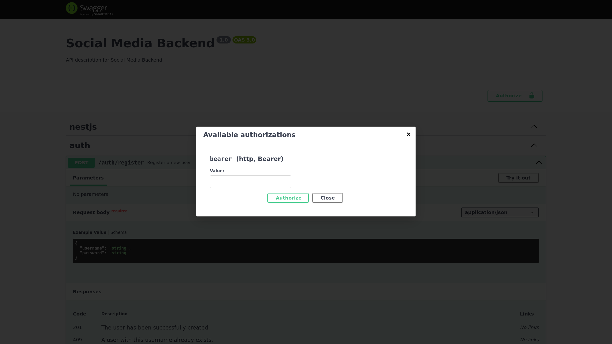
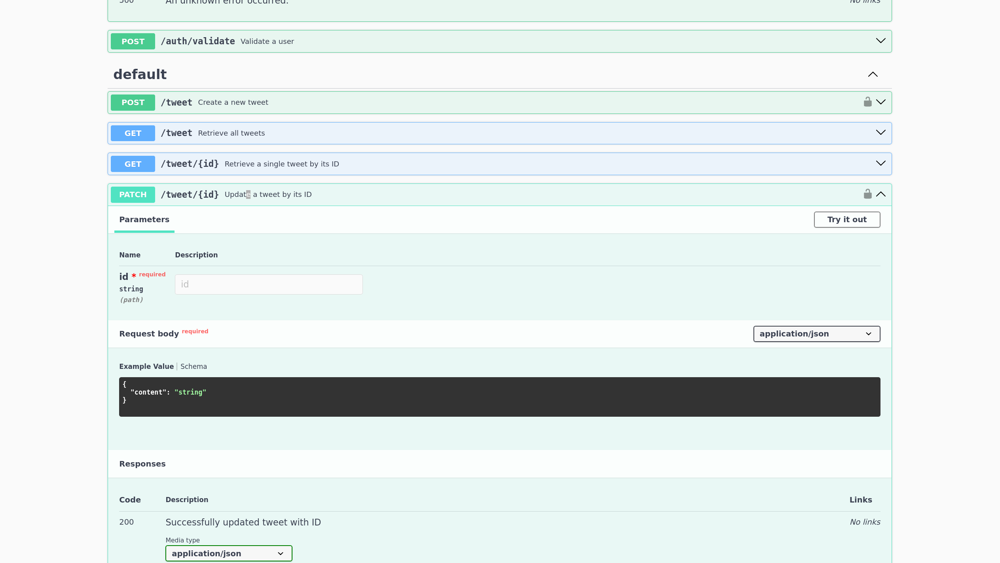

# NestJS API with PostgreSQL and JWT Authentication

This repository contains the code for an internship task completed for CodeInbound. The task involved creating a Node.js-based API using NestJS that interacts with a PostgreSQL database. The API supports CRUD (create, read, update, and delete) operations, implements user authentication and authorization using JSON Web Tokens (JWTs), and includes error handling and validation.

## Features

- **NestJS**: This project uses NestJS, a powerful and extensible Node.js framework, to build the API.

- **PostgreSQL**: The PostgreSQL database is used for storing and managing data.

- **TypeORM**: TypeORM is utilized to define the data schema and interact with the PostgreSQL database.

- **JWT Authentication**: JSON Web Tokens (JWTs) are implemented for user authentication and authorization.

- **Validation**: Class-validator pipes are used to validate the data passed in the request body.

- **Swagger Documentation**: Swagger documentation is included for clear API documentation and testing.

- **Docker for PostgreSQL**: Instructions for setting up a PostgreSQL database using Docker are provided.

- **Git and GitHub**: Git is used for version control, and the code is hosted on GitHub.

## Prerequisites

Before running the project, ensure you have the following dependencies installed:

- [Node.js](https://nodejs.org/)
- [Docker](https://www.docker.com/)

## Getting Started

Follow these steps to run the project:

1. Clone the repository to your local machine:

   ```bash
   git clone git@github.com:SubstantialCattle5/SocialMediaBackend.git
   ```

2. Install the project dependencies:

   ```bash
   cd SocialMediaBackend
   yarn 
   ```

3. Set up the PostgreSQL database using Docker:

   ```bash
   docker compose -up dev-db d 
   ```

4. Create a `.env` file in the project root and configure the database connection:

   ```env
   DB_HOST=localhost
   DB_PORT=5432
   DB_USERNAME=postgres
   DB_PASSWORD=postgres
   DB_DATABASE=postgres
   ```

5. Start the NestJS application:

   ```bash
   yarn run start:dev
   ```

7. The API should now be running locally. You can access the Swagger documentation at [http://localhost:3000/docs](http://localhost:3000/docs) to explore and test the API endpoints.

## API Endpoints

### Auth
- `POST /auth/register`: Register a new user.
- `POST /auth/login`: Log in and receive a JWT token.

## Tweet
- `GET /tweet`: Get a list of all tweets.
- `GET /tweet/:id`: Get a single tweet by ID.
- `POST /tweet`: Create a new tweet (requires authentication).
- `PUT /tweet/:id`: Update an existing tweet (requires authentication).
- `DELETE /tweet/:id`: Delete a tweet (requires authentication).

## Usage

1. Register a new user using the `/auth/register` endpoint.

2. Log in with the registered user using the `/auth/login` endpoint to obtain a JWT token.

3. Use the JWT token for authenticated requests to create, update, or delete tweets.

4. Use the `/tweet` endpoints to interact with tweet data.
